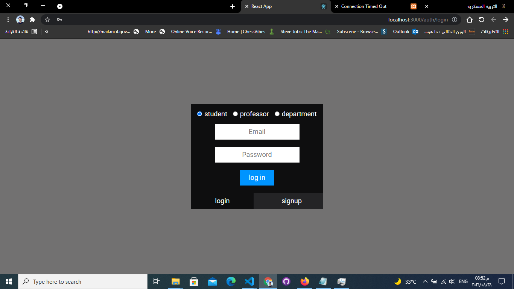
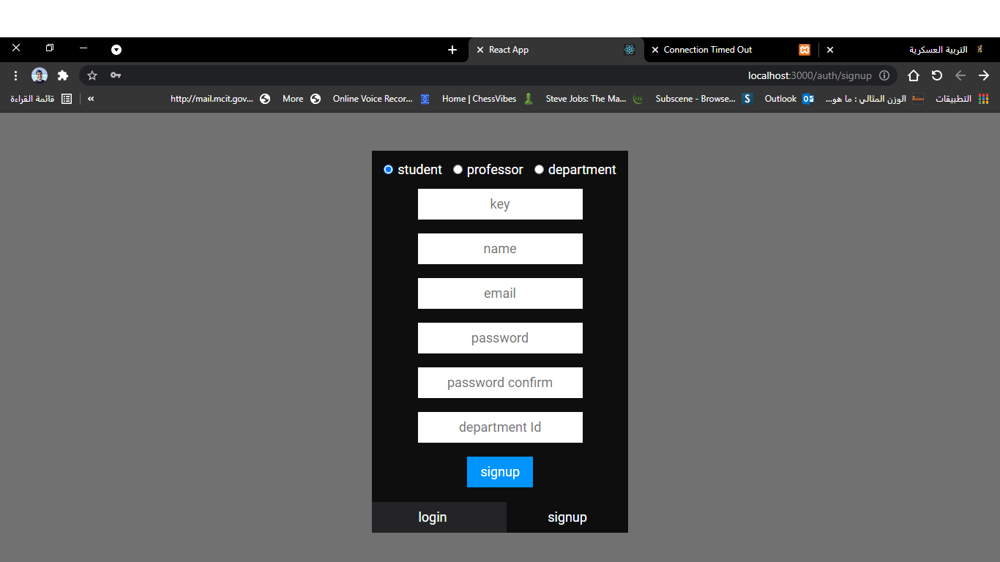
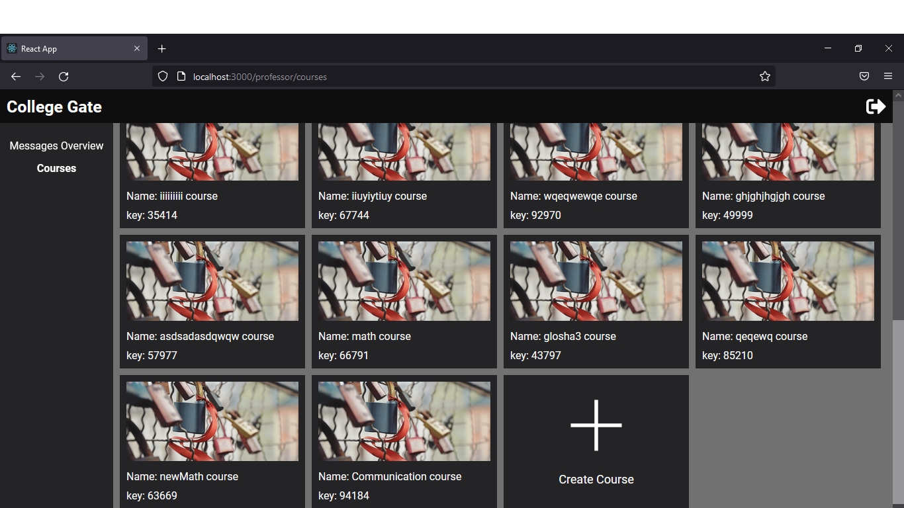
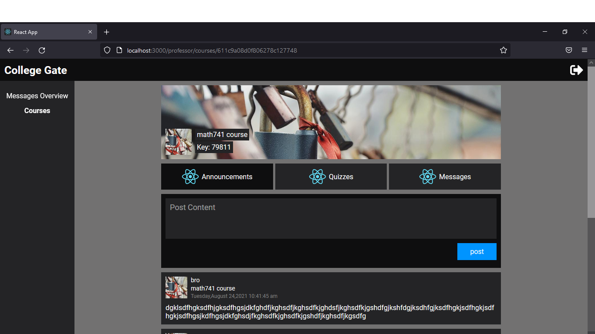
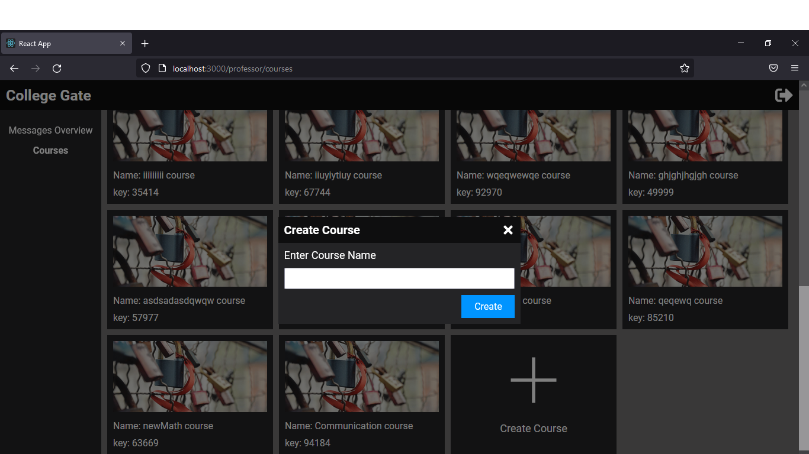
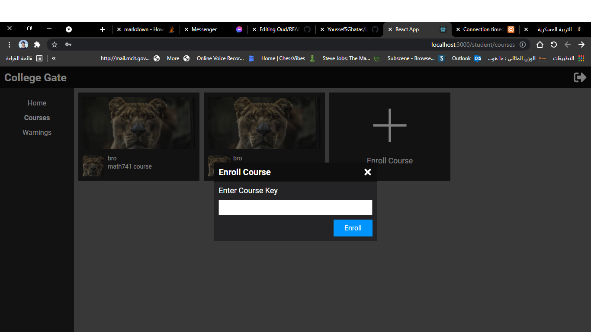
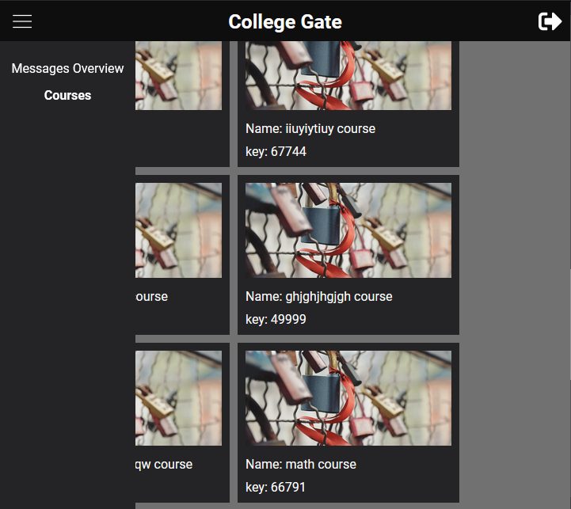
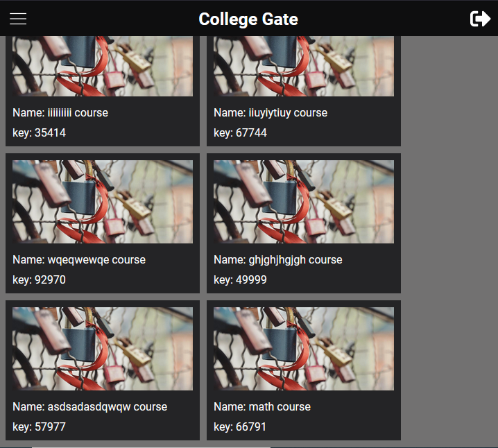

<h1 align="center"> College Gate </h1>

## Table of Contents

- [About the Project](#about-the-project)
  - [Functionalities](#functionalities)
  - [Build with](#build-with)
- [Getting Started](#getting-started)
  - [Installation for front-end](#installation-for-front-end)
  - [Running for front-end](#running-for-front-end)
  - [Installation for back-end](#installation-for-back-end)
  - [Running for back-end](#running-for-back-end)
- [Screen Shots](#screen-shots)
- [Video](#video)
- [File Structure](#file-structure)
- [License](#license)


## About The Project
> **ColleGate** is a community of students, professors and Employees of any college

### Functionalities
- Student
  - Enroll on professor's course under certain condition that professor and student should be in the same department
  - Send message to professor and recieve messages from him
  - Read professor's course posts
  - Send complaint to employee of his department
  - Sign up by certain key got from his department
- Professor
  - Create multiple courses on his department
  - Create quizzes for students
  - Send complaint to employee of his department
  - Send message to students and recieve from them
  - Sign up by certain key got from his department
- Employee
  - Send Warnings to students
  - Response to complaints 

### Build with
- [React JS](https://reactjs.org/)
- [React Router](https://reacttraining.com/react-router/web/guides/quick-start)

## Getting Started
> This is a list of needed instructions to set up your project locally, to get a local copy up and running follow these instructuins.

### Installation for front-end

1. **_Clone the repository_**

```sh
$ git clone https://github.com/youssefGitHub99/college-gate-front-end.git
```
2. **_Navigate to repository directory_**
```sh
$ cd college-gate-front-end
```

3. **_Install dependencies_**

```sh
$ npm install
```

### Running for front-end

**_Running on development mode_**
```sh
$ npm run 
```
### Installation for back-end

1. **_Clone the repository_**

```sh
$ git clone https://github.com/youssefGitHub99/College-Gate-Backend.git
```
2. **_Navigate to repository directory_**
```sh
$ cd College-Gate-Backend
```

3. **_Install dependencies_**

```sh
$ npm install
```

### Running for back-end

**_Running on development mode_**
```sh
$ npm run-script run
$ npm run-script dev
```
## Screen Shots

<hr />



<hr />



<hr />



<hr />



<hr />



<hr />



<hr />



<hr />

## Video
- [CollegeGate video](https://drive.google.com/file/d/1OQqD1L4pD9Ldq4rhuCvlOjnx0AO4MM-M/view?usp=sharing)

## File Structure
                                    
    college-gate-front-end
    ├── README.md
    ├── LICENSE
    ├───public
    │   └───Icons
    ├───src
        ├───API
        ├───Components
        │   ├───Account
        │   ├───Announcements
        │   ├───Courses
        │   ├───Department
        │   ├───Header
        │   ├───ItemButton
        │   ├───LogIn & SignUp
        │   ├───Messages
        │   ├───NotFound
        │   ├───Professor
        │   ├───Profile
        │   ├───RedirectHandler
        │   ├───SideBar
        │   ├───Student
        │   ├───Tab
        │   └───UserPreview
        ├───Contexts
 
## License

> This software is licensed under MIT License, See [License](https://github.com/AbdallahHemdan/oudFrontend/blob/master/LICENSE) for more information ©AbdallahHemdan.
